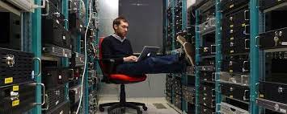

Un admininstrador de sistemas es la persona que se encagra de instalar, confiurar, actuializar. monitorizar, documentar y adaptar a las nuevasnecesidades los sistemas informáticos de una organización.

